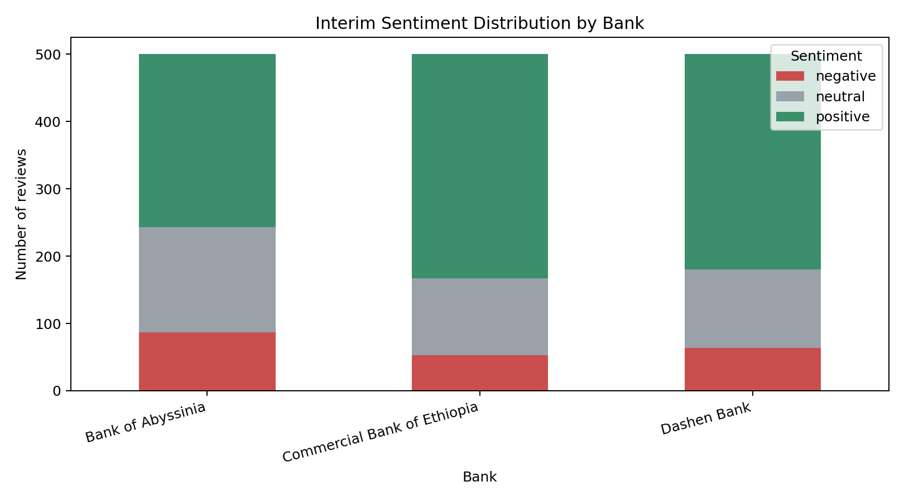

# Fintech Review Analytics - Interim Submission Report

Due date from PDF: 18 May 2026, 8:00 PM UTC for the interim submission.

## Scope

This submission focuses on Task 1 and partial Task 2 progress:

- Task 1 is complete on `main`: scraping, preprocessing, `.gitignore`, CI, requirements, tests, and documentation are present.
- Task 2 partial progress is complete on `main`: VADER sentiment labels/scores, an `identified_theme` column, and TF-IDF keyword extraction are implemented.
- The existing repository history includes the merged `task-2` branch.

## Scraping Methodology and Data Quality

The scraper uses `google-play-scraper` to collect newest available Google Play
reviews for Commercial Bank of Ethiopia, Bank of Abyssinia, and Dashen Bank.
The run used the README command with `--count 500`, collecting 500 reviews per
bank and 1,500 raw reviews total.

Preprocessing removes duplicate records by `review_id`, drops rows missing
`review_text` or `rating`, removes blank review text, converts ratings to
numeric values, and normalizes dates to `YYYY-MM-DD`.

Current local output summary:

| Bank | Clean reviews | Average rating | Average sentiment | Negative share |
| --- | ---: | ---: | ---: | ---: |
| Bank of Abyssinia | 500 | 3.57 | 0.172 | 17.4% |
| Commercial Bank of Ethiopia | 500 | 4.11 | 0.274 | 10.6% |
| Dashen Bank | 500 | 3.93 | 0.290 | 12.8% |

Data quality notes:

- Clean output rows: 1,500.
- Missing review text after cleaning: 0.
- Missing rating after cleaning: 0.
- Generated CSV files are ignored by git and reproducible using the commands in `README.md`.

## Early Sentiment Findings

The interim analysis uses VADER for fast, reproducible sentiment scoring. The
sentiment output contains `sentiment_label`, `sentiment_score`, and
`identified_theme` columns for 1,500 reviews.

Early observations:

- Bank of Abyssinia has the highest interim negative share at 17.4%, with a lower average rating than the other two banks.
- Commercial Bank of Ethiopia has the highest average rating in the current sample and the lowest negative share.
- Dashen Bank has the highest average VADER sentiment score, but still has notable transaction and usability keywords to review.

## Thematic Progress

Initial keyword rules assign each review to one of these draft themes:

- Account Access
- Transaction Performance
- Reliability and Crashes
- UI and Usability
- Customer Support
- General Feedback

TF-IDF keyword extraction is implemented by `bank_name` and `sentiment_label`.
Those outputs will be used to finalize 3-5 themes per bank with supporting
keyword examples.

## Blockers and Limitations

- Google Play review availability can vary by region, language, and app, so fresh reruns may produce a different date window.
- VADER is used for the interim submission because it is lightweight and reproducible; DistilBERT comparison can be added for the final report if time allows.
- Draft theme labels are keyword-based and need manual review against the TF-IDF output before final bank-specific recommendations.

## Final Submission Plan

- Finalize theme grouping with keyword evidence and bank-level summaries.
- Add PostgreSQL schema and loading workflow for the cleaned review data.
- Produce stakeholder-ready charts, bank-specific recommendations, ethics notes, and the final PDF report.
